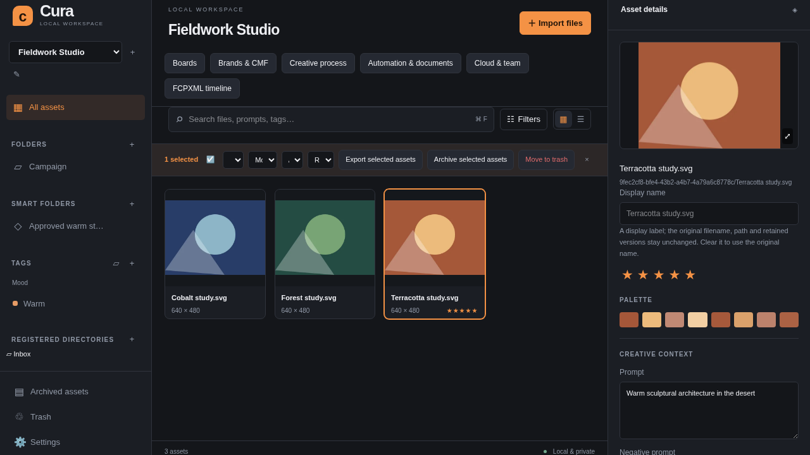
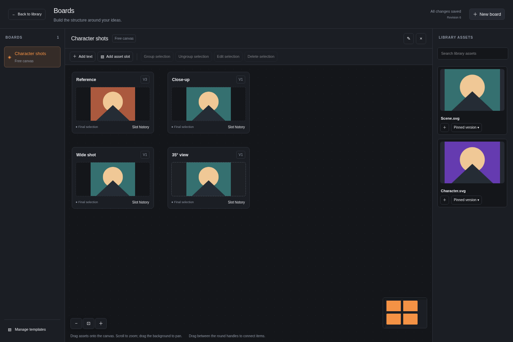
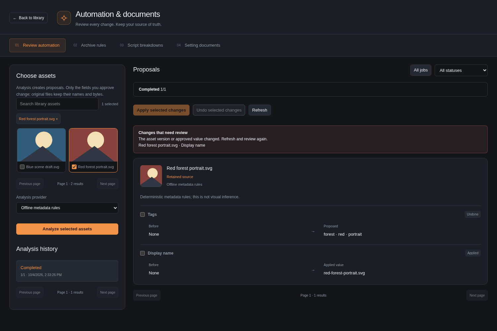

# Cura

Cura is a local-first visual asset manager for AI creators, brand designers, and product designers. Run a local server, open your browser, and organize images without an account. Your files and their creative context stay on your computer.

The current workflow includes watched folders and uploads, metadata extraction, folders and colored tags, search and filters, previews, annotations, retained versions, and diagnostics. Canvas/slot/matrix workflows, brands and CMF, rich previews, creative-process statistics and portable exports are available. [v0.3.0](https://github.com/Sokol13/Cura/releases/tag/v0.3.0) adds reviewable automation, retained scripts and setting documents, optional Supabase team libraries and FCPXML timelines. [v0.3.1](https://github.com/Sokol13/Cura/releases/tag/v0.3.1) improves large PSD previews, directory cleanup/scan diagnostics, localization and Node 24 compatibility. See the [release report](docs/REPORT-v0.3.1.md), [desktop smoke checklist](docs/SMOKE_TEST.md) and [progress](docs/PROGRESS.md) for verified results and platform limits.



## Start on macOS or Windows

Install a current patch of **Node.js 24 or 22**, **pnpm 10.34.6**, and Git. Cura accepts Node `>=22 <25`; CI runs the complete suite on both LTS majors. [SETUP.md](docs/SETUP.md) includes macOS Homebrew and Windows winget/official-installer instructions. GitHub CLI and an account are not needed to use Cura.

macOS Terminal:

```bash
git clone https://github.com/Sokol13/Cura.git
cd Cura
pnpm install
pnpm start
```

Windows PowerShell:

```powershell
git clone https://github.com/Sokol13/Cura.git
cd Cura
pnpm.cmd install
pnpm.cmd start
```

`pnpm start` builds the application and opens the default browser at [http://127.0.0.1:3000](http://127.0.0.1:3000). Keep the terminal open; Ctrl+C stops Cura. Once dependencies are installed, daily library work runs offline. The service binds only to the loopback interface.

## Use the library

1. Create a library in the left sidebar. **Register folder** browses directories on the computer running Cura and watches the chosen folder recursively. **Import files**, file selection, or drag and drop copies files into readable, local-date Inbox folders; repeated names receive a short suffix.
2. Browse the virtualized grid/list. Select an asset to inspect dimensions, size, EXIF, palette, source, model, prompt, negative prompt, and seed. Edit descriptive fields, tags, notes, or rating, then save.
3. Create nested logical folders, colored tags and tag groups. Filter by folder/tag plus format, exact rating, source, color, indexed date, and minimum dimensions. Smart collections save a search and its filters.
4. Search filenames, tags, prompts, and notes. English terms use full-text matching; Chinese/CJK input also uses substring matching. Click a palette swatch for nearby colors, or **Similar images** for visual pHash ranking. This is visual similarity, not semantic or face recognition.
5. Open preview with Space or the preview control. Zoom, add/edit anchored text annotations, move between assets with arrow keys, inspect versions, replace the current file, and compare two versions side by side. An open current preview follows a watched file replacement; a selected historical version remains selected. Download an individual retained version when needed.
6. Set a readable display name without renaming the original. Use multi-selection for ratings, folders, tags, archive/restore and trash/restore. Archive is separate from Trash; assets selected as final, including historical pins, are protected. Trash is reversible. Settings provides language, theme, panel widths, rescan, thumbnail cache usage/clear/rebuild, and a diagnostic ZIP download. Clearing thumbnails preserves originals and retained versions; rebuild restores their previews.

The default interface is Simplified Chinese with a dark theme and orange accents. English, light/system themes, grid/list choice, and panel widths are saved locally. Cmd/Ctrl+F focuses search, arrow keys change selection, Space previews, and Delete moves selected assets to Trash; shortcuts do not replace normal editing inside text fields.

## Files and metadata

Folder scans include all nested subdirectories and do not follow symbolic links. Expand the latest scan summary beneath each registered directory to see supported-file counts, skipped extensions, read errors and completion time, including a completed empty folder. New automatic imports accept PNG/JPEG/WebP/GIF/SVG/AVIF, PSD/PDF/GLB/OBJ/MP4/MOV and TTF/OTF/WOFF/WOFF2 (including JPG/JPE/JFIF aliases). Other new files are counted as skipped; manually import them to manage them with a generic preview. Previously tracked generic files retain their history and watcher updates. Supported-file counts can exceed asset counts when bytes are duplicates.

Registering a folder leaves original files in place. Cura also retains one immutable snapshot per distinct file content so an external overwrite cannot destroy an older version. **This uses additional disk space**: plan for the retained unique versions plus thumbnails; uploads also have Inbox copies. Logical folders, tags, manual replacement, and Trash do not rewrite registered originals. Missing sources are marked without discarding their saved previews/history; a renamed source keeps its asset identity when its content matches. When unregistering a directory, choose between stopping its watcher and retaining offline assets, or moving its orphaned assets to recoverable Trash (the default). Assets with another available source remain in the library. Use Filters → Source file unavailable to find and batch-process offline assets. Re-registering the same directory reuses identities and does not automatically restore Trash. See [storage and backup](docs/SETUP.md#data-directories-and-backup).

PNG, JPEG, WebP, GIF, SVG, and AVIF receive image previews. PSD thumbnails use embedded previews or a bounded server-worker composite decoder. GLB/OBJ, PDF first pages and browser-decodable H.264 MP4/MOV receive bounded browser-generated thumbnails while their library is open. Unsupported encodings remain manageable with an explicit preview state; [PREVIEWS.md](docs/PREVIEWS.md) lists the precise limits. GIF thumbnails use the first frame, and SVG previews are rasterized. Flat-color artwork can have fewer than five palette colors. Browser uploads/replacements are limited to 100 MiB per file; oversized or unsupported image decoding falls back to a manageable asset.

Generation metadata is read from data actually embedded in PNGs:

- SD WebUI: `parameters`, including multiline prompts and exact seed strings.
- ComfyUI: supported connected nodes in the `prompt` execution graph, with original workflow/parameters retained. Workflow-only files, unknown custom nodes, and ambiguous output branches can produce partial fields and warnings rather than guesses.
- Midjourney: explicitly named `Midjourney Prompt`, `Midjourney Model`, and `Midjourney Seed` fields. There is no universal Midjourney metadata format; Cura does not infer missing information from a filename.

The inspector exposes raw parameters and parser warnings. You can correct missing fields manually; those corrections stay with the current version when it is later archived. Notes and ratings belong to the asset across versions. Cura does not embed edits back into originals. Similarity is available only for images with a valid perceptual hash; other files display an explanatory hint.

## Design and creative workspaces

- **Boards:** Place assets, text and groups on a pannable canvas; connect items and save layouts. Character, scene, product and brand templates provide slots. Dragging an exact asset version from the tray or an existing canvas item into a slot finalizes that version; replacing the slot appends its own revision history. Character-angle and scene-option matrices retain assignments when axes change. [Board guide](docs/BOARDS.md).
- **Brands & CMF:** Build named HEX/RGB/CMYK palettes, register font files, pin logo variants, write guidelines and compose material/color/finish entries. Export self-contained HTML, paginated PDF, JSON and ASE. PDF text is rasterized to preserve the browser's Chinese/font appearance; HTML/JSON retain editable text. CMYK values are unprofiled arithmetic conversions. [Brand guide](docs/BRANDS.md).
- **Creative process:** Inspect prompt/version history and selection rates by model/source. Counts measure distinct recorded outputs, not unknown past attempts. The clearly labeled local mock produces real deterministic images without an external generation service. Selection actions validate the displayed version. [Process and export guide](docs/PROCESS-EXPORT.md).
- **Neutral export:** Export a whole library from Creative process, or selected assets from the catalog's selection toolbar. The ZIP extracts into a readable folder containing original/version bytes, `manifest.json`, `assets.csv` and a README. It retains trash, archive/display labels, unavailable-source history, organization, annotations, boards, brands, process metadata, completed automation/documents, sync conflicts and completed FCPXML request history; selected exports include referenced dependencies. Every byte is hash-verified. Classic ZIP bounds are explicit: 3.5 GB including metadata and 65,532 distinct payload files. Oversized or missing/corrupt-byte exports fail visibly; split the selection when needed.



## Automation, scripts, cloud and timelines

- **Automation & documents:** Analyze into reviewable tag/name proposals, apply selected fields and undo unchanged applied fields. Offline metadata rules are labelled explicitly; a configured OpenAI-compatible vision adapter can inspect image bytes. Strict JSON and explicit caption modes retain distinct provenance. Saved rules archive non-final work in cancellable batches, while original files stay unchanged. [Automation guide](docs/AUTOMATION.md).
- Import UTF-8 text, Markdown or Fountain scripts and edit character/prop/scene lists with exact retained line references. Generate editable setting documents from pinned versions and metadata, then export Markdown/JSON. Offline structured parsing does not infer arbitrary prose; a configured text provider can perform model-assisted extraction. [Workspace guide](docs/AUTOMATION-UI.md).
- **Cloud & team:** Optional Supabase password login, incremental verified file/metadata transfer, local-wins conflicts and owner/editor/viewer sharing. Configure only the server; access/refresh tokens stay server-side, and passwords/tokens are not persisted in browser storage or library exports. Without configuration the workspace shows Local mode and all local features remain available. [Cloud guide](docs/CLOUD-WORKSPACE.md), [Supabase setup and RLS](supabase/README.md).
- **FCPXML timeline:** Arrange exact historical image/video pins, inspect source timing, set frame counts and export FCPXML 1.7 with retained media. Transfer the ZIP and run its standalone `relink.mjs` on the editing computer before importing. Supported timing/codecs and physical Final Cut Pro verification limits are explicit in the [FCPXML guide](docs/FCPXML.md).



[PRD.md](docs/PRD.md) and [PROGRESS.md](docs/PROGRESS.md) distinguish implemented features, verified gates and published tags.

## Development and verification

```bash
pnpm dev
```

Open [http://127.0.0.1:5173](http://127.0.0.1:5173); Vite proxies the local API. Production uses port 3000. Port/data-directory overrides and native-prebuilt troubleshooting are in [SETUP.md](docs/SETUP.md).

| Directory         | Responsibility                                                                              |
| ----------------- | ------------------------------------------------------------------------------------------- |
| `packages/shared` | Zod HTTP/WebSocket contracts and shared types                                               |
| `packages/server` | Fastify, SQLite/Drizzle, worker-based media processing, watchers, retained bytes, local API |
| `packages/web`    | React, Vite, Tailwind, Zustand, virtualized library and preview UI                          |
| `e2e`             | Real-server Chromium workflows and scale acceptance                                         |
| `scripts`         | Setup, native-prebuilt checks, deterministic image fixtures                                 |
| `docs`            | [Architecture](docs/ARCHITECTURE.md), setup, tests, requirements, decisions and progress    |

```bash
pnpm exec playwright install chromium chrome
python3 -m pip install lxml==6.1.1
python3 scripts/validate-fcpxml.py --prepare
pnpm lint
pnpm typecheck
pnpm test
pnpm e2e
```

Python/lxml and the downloaded Apple DTD are development-only independent FCPXML checks; normal `pnpm install && pnpm start` needs neither. Real Supabase integration uses a disposable local Docker stack; see the separate configured acceptance command in [the cloud guide](docs/CLOUD-WORKSPACE.md).

E2E uses the installed Chrome channel for native H.264 MP4/MOV decoding, or the explicitly configured `CURA_CHROMIUM_EXECUTABLE` build. The browser is a test/user prerequisite, not a Cura runtime dependency.

[TESTING.md](docs/TESTING.md) separates measured evidence from pending checks. Use the [10-minute desktop smoke checklist](docs/SMOKE_TEST.md) on macOS/Windows. GitHub Actions runs quality gates for pushes/PRs and creates releases for validated `v*` tags.

## License

Cura source is [MIT licensed](LICENSE). Dependencies retain their own licenses, including the Sharp native-runtime exception documented in [DEPENDENCIES.md](docs/DEPENDENCIES.md).
