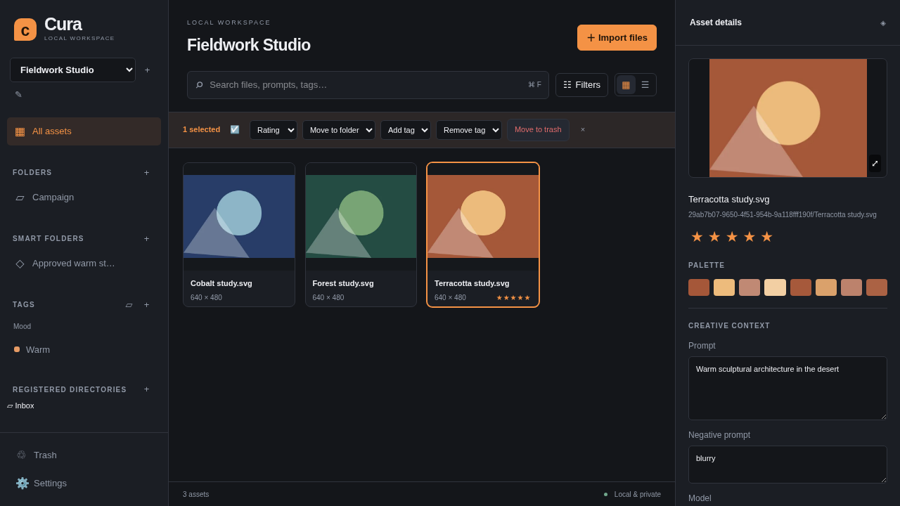

# Cura

Cura is a local-first visual asset manager for AI creators, brand designers, and product designers. Run a local server, open your browser, and organize images without an account. Your files and their creative context stay on your computer.

The current v0.1 workflow includes watched folders and uploads, metadata extraction, folders and colored tags, search and filters, image previews, annotations, retained versions, and diagnostics. [PROGRESS.md](docs/PROGRESS.md) records integration and validation status; a feature description here is not a claim that a milestone has been released.



## Start on macOS or Windows

Install **Node.js 22**, **pnpm 10.34.6**, and Git. [SETUP.md](docs/SETUP.md) includes macOS Homebrew and Windows winget/official-installer instructions. GitHub CLI and an account are not needed to use Cura.

macOS Terminal:

```bash
git clone https://github.com/Sokol13/Cura.git
cd Cura
pnpm install
pnpm start
```

Windows PowerShell:

```powershell
git clone https://github.com/Sokol13/Cura.git
cd Cura
pnpm.cmd install
pnpm.cmd start
```

`pnpm start` builds the application and opens the default browser at [http://127.0.0.1:3000](http://127.0.0.1:3000). Keep the terminal open; Ctrl+C stops Cura. Once dependencies are installed, daily library work runs offline. The service binds only to the loopback interface.

## Use the library

1. Create a library in the left sidebar. **Register folder** browses directories on the computer running Cura and watches the chosen folder recursively. **Import files**, file selection, or drag and drop copies files into a managed Inbox.
2. Browse the virtualized grid/list. Select an asset to inspect dimensions, size, EXIF, palette, source, model, prompt, negative prompt, and seed. Edit descriptive fields, tags, notes, or rating, then save.
3. Create nested logical folders, colored tags and tag groups. Filter by folder/tag plus format, exact rating, source, color, indexed date, and minimum dimensions. Smart collections save a search and its filters.
4. Search filenames, tags, prompts, and notes. English terms use full-text matching; Chinese/CJK input also uses substring matching. Click a palette swatch for nearby colors, or **Similar images** for visual pHash ranking. This is visual similarity, not semantic or face recognition.
5. Open preview with Space or the preview control. Zoom, place anchored text annotations, inspect versions, replace the current file, and compare two versions side by side. Download an individual retained version when needed.
6. Use multi-selection for ratings, folders, tags, and trash/restore. Trash is reversible. Settings provides language, theme, panel widths, rescan, thumbnail rebuilding, and a diagnostic ZIP download.

The default interface is Simplified Chinese with a dark theme and orange accents. English, light/system themes, grid/list choice, and panel widths are saved locally. Cmd/Ctrl+F focuses search, arrow keys change selection, Space previews, and Delete moves selected assets to Trash; shortcuts do not replace normal editing inside text fields.

## Files and metadata

Registering a folder leaves original files in place. Cura also retains one immutable snapshot per distinct file content so an external overwrite cannot destroy an older version. **This uses additional disk space**: plan for the retained unique versions plus thumbnails; uploads also have Inbox copies. Logical folders, tags, manual replacement, and Trash do not rewrite registered originals. See [storage and backup](docs/SETUP.md#data-directories-and-backup).

PNG, JPEG, WebP, GIF, SVG, and AVIF receive image previews; other files remain manageable with generic icons. GIF thumbnails use the first frame, and SVG previews are rasterized. Flat-color artwork can have fewer than five palette colors. Browser uploads/replacements are limited to 100 MiB per file; oversized or unsupported image decoding falls back to a manageable asset.

Generation metadata is read from data actually embedded in PNGs:

- SD WebUI: `parameters`, including multiline prompts and exact seed strings.
- ComfyUI: supported connected nodes in the `prompt` execution graph, with original workflow/parameters retained. Workflow-only files, unknown custom nodes, and ambiguous output branches can produce partial fields and warnings rather than guesses.
- Midjourney: explicitly named `Midjourney Prompt`, `Midjourney Model`, and `Midjourney Seed` fields. There is no universal Midjourney metadata format; Cura does not infer missing information from a filename.

The inspector exposes raw parameters and parser warnings. You can correct missing fields manually; Cura does not embed those edits back into originals.

Canvas/slot/matrix workflows, brand and CMF kits, PSD/PDF/video/3D thumbnails, and whole-library neutral export are **P1 work**, not part of v0.1. Agent automation, Supabase/team synchronization, and FCPXML are P2. [PRD.md](docs/PRD.md) defines the roadmap.

## Development and verification

```bash
pnpm dev
```

Open [http://127.0.0.1:5173](http://127.0.0.1:5173); Vite proxies the local API. Production uses port 3000. Port/data-directory overrides and native-prebuilt troubleshooting are in [SETUP.md](docs/SETUP.md).

| Directory         | Responsibility                                                                              |
| ----------------- | ------------------------------------------------------------------------------------------- |
| `packages/shared` | Zod HTTP/WebSocket contracts and shared types                                               |
| `packages/server` | Fastify, SQLite/Drizzle, worker-based media processing, watchers, retained bytes, local API |
| `packages/web`    | React, Vite, Tailwind, Zustand, virtualized library and preview UI                          |
| `e2e`             | Real-server Chromium workflows and scale acceptance                                         |
| `scripts`         | Setup, native-prebuilt checks, deterministic image fixtures                                 |
| `docs`            | [Architecture](docs/ARCHITECTURE.md), setup, tests, requirements, decisions and progress    |

```bash
pnpm exec playwright install chromium
pnpm lint
pnpm typecheck
pnpm test
pnpm e2e
```

[TESTING.md](docs/TESTING.md) separates measured evidence from pending checks. Use the [10-minute desktop smoke checklist](docs/SMOKE_TEST.md) on macOS/Windows. GitHub Actions runs quality gates for pushes/PRs and creates releases for validated `v*` tags.

## License

Cura source is [MIT licensed](LICENSE). Dependencies retain their own licenses, including the Sharp native-runtime exception documented in [DEPENDENCIES.md](docs/DEPENDENCIES.md).
