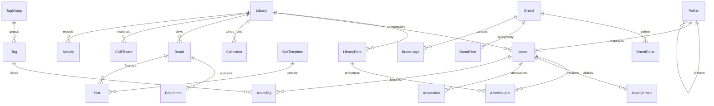

# Architecture

Cura is a local-first asset catalog, served by Node 22–24 (`>=22 <25`, with full CI on 22 and 24) on `127.0.0.1` to a browser. HTTP and WebSocket are the only web/server boundary. The desktop browser never uses proprietary filesystem APIs. AGENTS.md is the feature specification; this document fixes implementation interfaces.

## Packages and boundaries

- `packages/shared/src/catalog.ts`: Zod request/response/event contracts, inferred public types. JSON uses camelCase, IDs are UUID strings, timestamps are ISO strings, colors are HEX strings.
- `packages/server/src/catalog-store.ts`: SQLite transactions, domain integrity, FTS5, filtering and version lineage; consumes the existing migrated database.
- `packages/server/src/media/metadata.ts`: pure PNG metadata parser and generation-field normalization.
- `packages/server/src/media/worker.ts`: filesystem enumeration, streaming SHA-256, immutable snapshots, Sharp thumbnails, EXIF, palette and perceptual hashing, away from the request thread.
- `packages/server/src/media/service.ts`: bounded worker queue, root registration, chokidar events, rescan and recovery.
- `packages/server/src/catalog-routes.ts`: validated local HTTP and WebSocket endpoints; file access through catalog IDs, never arbitrary file download paths.
- `packages/web/src/catalog/`: library shell, virtualized asset view, inspector, preview and organization controls. Zustand stores view state; i18next owns UI strings. Only local static assets/fonts.
- P1 `boards`, `brands`, `exports`, and P2 `automation`, `sync`, `fcpxml` are independent modules using the same store and shared contracts.

## Storage and ownership

SQLite, logs, thumbnail cache, settings and immutable version snapshots live only in OS user-data/cache/log directories (or explicit CLI/environment overrides). A library is a logical catalog; it has zero or more referenced roots and one managed Inbox under the data directory. Registering a directory never writes to or renames originals. Upload copies bytes into Inbox. Removing an asset from the catalog is reversible soft deletion; permanent removal never deletes a referenced original.

Every ingested version has a content-addressed immutable snapshot before becoming visible. Replacing a referenced file can therefore preserve the previous bytes even after an external editor overwrites the source. Snapshots are deduplicated by SHA-256; displayed names remain human-readable. Database relative paths are normalized NFC with `/` as the stored separator; physical paths retain actual filesystem spelling in source aliases. Filesystem operations always use `path` helpers and realpath containment. Symlinks escaping registered roots are rejected. Upload names cannot contain separators or dot traversal.

Content duplicates merge within a library, keeping all source aliases. NFC/NFD variants of the same relative path identify one source; new differing bytes at that source append a version. Filename deduplication must not destroy distinct assets in different roots. If one of several live source aliases changes bytes, fork that alias into a new asset with inherited history and metadata before appending its version. Unchanged aliases retain the original asset, preventing alternating rescans from changing its latest version. Each source retains its last observed content hash and availability. Missing aliases do not cause false forks after a rename; assets with no available source retain history and expose a missing-source indicator. A complete rescan reconciles missing sources only when its root revision is still current; partial enumeration errors and stale worker results cannot erase newer watcher state.

Version bytes are immutable. Manual generation-field corrections update the current asset and its current version together, so subsequent replacement archives the corrected prompt/model/source/seed/parameters. Asset-level notes, ratings, folders and tags remain shared across versions. Version-specific annotations retain their asset/version ownership when their text or coordinates are edited.

## Data model

All persisted domain tables have `created_at` and `updated_at`. SQL migrations are versioned and run through Drizzle. SQL owns constraints and transactions; FTS5 and performance-sensitive searches use prepared SQLite statements.

`Asset`: id, libraryId, rootId, relativePath, name, displayName, archivedAt, hash, type, size, width, height, colors, phash, rating, note, source, model, prompt, negativePrompt, seed, params, exif, folderId, deletedAt, finalized, missing, createdAt, updatedAt. `AssetVersion`: id, assetId, ordinal, hash, snapshotPath, thumbnailPath, file metadata and generation metadata. Source aliases map asset/root/normalized relative path to actual relative path, last hash and availability; migration `0002_source_availability.sql` adds availability tracking. Annotation coordinates are normalized `[0,1]` and attach to a version. Folder parents cannot cycle or cross libraries. Smart collections persist validated query rules. Snapshot/thumbnail filesystem paths are private store fields and are never serialized into public version responses.

## HTTP contracts

All JSON request bodies and query strings are parsed with shared Zod schemas. Responses are validated with the corresponding schema. Failures return `{ error: string, code: string }`; invalid input is 400, unknown IDs 404, conflict 409, inaccessible paths 403. Permission errors carry actionable text including macOS Full Disk Access and Windows file-in-use guidance.

| Endpoint                                          | Purpose                                                                     |
| ------------------------------------------------- | --------------------------------------------------------------------------- |
| `GET /api/health`                                 | Existing startup health                                                     |
| `GET, POST /api/libraries`                        | List/create logical catalogs                                                |
| `GET /api/directories?path=`                      | Explicit local directory picker, directories only; no arbitrary file reads  |
| `GET, POST /api/libraries/:libraryId/roots`       | List/register referenced roots and start background scan                    |
| `GET /api/libraries/:libraryId/scans`             | Latest persisted recursive scan summaries for active roots                  |
| `POST /api/libraries/:libraryId/rescan`           | Reconcile interrupted scans and roots                                       |
| `POST /api/libraries/:libraryId/upload?name=`     | Raw-byte upload, bounded 100 MiB, copy to Inbox                             |
| `GET /api/libraries/:libraryId/assets`            | Paginated search and combined filters                                       |
| `GET, PATCH /api/assets/:assetId`                 | Full asset record and editable metadata                                     |
| `POST /api/libraries/:libraryId/assets/batch`     | Validated batch rating/folder/tags/trash/restore                            |
| `GET /api/assets/:assetId/versions`               | Immutable version history                                                   |
| `POST /api/assets/:assetId/replace?name=`         | Upload replacement, archive previous version                                |
| `GET /api/versions/:versionId/file`               | Safe file stream with content-type and nosniff                              |
| `GET /api/versions/:versionId/thumbnail`          | Safe cached preview; SVG originals never inline-executable                  |
| `GET, POST /api/assets/:assetId/annotations`      | Version-specific image notes                                                |
| `PATCH, DELETE /api/annotations/:id`              | Edit text/coordinates without changing ownership, or remove a note          |
| `GET, POST /api/libraries/:libraryId/folders`     | Hierarchical catalog folders                                                |
| `GET, POST /api/libraries/:libraryId/tags`        | Colored/grouped tags                                                        |
| `GET, POST /api/libraries/:libraryId/collections` | Saved searches                                                              |
| `GET, PATCH /api/settings`                        | Persist language/theme/layout in user data; Zustand mirrors server settings |
| `GET, POST /api/libraries/:libraryId/tag-groups`  | Named tag groups                                                            |
| `PATCH, DELETE /api/folders/:id`                  | Rename/reparent/delete logical folders safely                               |
| `PATCH, DELETE /api/tags/:id`                     | Edit/remove tags                                                            |
| `PATCH, DELETE /api/tag-groups/:id`               | Edit/remove groups without deleting assets                                  |
| `PATCH, DELETE /api/collections/:id`              | Update/remove saved rules                                                   |
| `DELETE /api/roots/:id`                           | Unregister root and stop watcher; retained snapshots remain                 |
| `PATCH /api/libraries/:libraryId`                 | Rename catalog                                                              |
| `GET /api/diagnostics`                            | ZIP with scans, warnings, queues, database integrity and system stats       |
| `GET /api/cache`                                  | Thumbnail cache file count and bytes                                        |
| `POST /api/cache/clear`                           | Remove cached previews only; preserve originals and retained snapshots      |
| `POST /api/cache/rebuild`                         | Rebuild previews for all retained versions, including trashed assets        |
| `GET /api/events`                                 | WebSocket progress, asset changes and errors                                |

Asset queries: `q`, `folderId`, `tagId`, `rating`, `type`, `color`, `source`, `after`, `before`, `minWidth`, `minHeight`, `similarTo`, `trash`, `archived`, `offset`, `limit`. Combining means AND. Text search covers filename, prompt, model, source, note and tag names; FTS syntax is quoted/escaped as user text. For Chinese and other unsegmented CJK input, combine FTS5 with indexed-library bounded substring matching (including one- and two-character terms) against the same normalized search text; benchmark this path at the release fixture scale. Color distance ranks palette matches; pHash Hamming distance ranks similar images. A similarity reference without a valid hash returns `400 SIMILARITY_UNAVAILABLE`; candidates without valid hashes are excluded. Responses include `{ items, total }` and pagination never exceeds 200 records.

WebSocket events: `{ type: 'scan' | 'asset' | 'error' | 'thumbnail' | 'board', libraryId, rootId?, assetId?, boardId?, completed?, total?, scanId?, status?, scanSummary?, message?, code? }`. UI refetches active data and the open preview; reconnect also refreshes. A bounded recent-error buffer replays startup scan failures to later subscribers and clears repaired-root errors. HTTP remains authoritative when sockets disconnect. The browser uses error codes to render localized permission guidance.

Settings patches contain only explicitly supplied fields; changing one preference does not reset omitted language/theme/library/layout values. Diagnostics retain `diagnostics.json` and `logs.json`. The former includes system/version/statistics, each active registered root's latest scan (or explicit no history), the immediate bounded worker queue, retained-version preview state counts, and read-only SQLite integrity/foreign-key checks. Browser activity is not inferred from stored pending states. Each section reports capture failure independently; even a corrupt database can produce a useful ZIP. Integrity runs in a separate read-only worker with a five-second deadline, shared in-flight work and at most 20 safe issues.

The last 200 warning/error/fatal records are persisted independently of HTTP info traffic in `diagnostic-warnings.json` under the user log directory, using atomic writes and startup restoration. Fastify and child logger warnings plus actual scan, metadata and thumbnail failures enter the same journal before startup work. Only fixed messages, known codes, timestamps, severity, UUIDs and counts survive capture; scan error paths are redacted on export. Asset bytes, full metadata, arbitrary messages/objects, stack traces, credentials and paths are excluded. A damaged/unwritable journal is explicit in the ZIP; production console/`cura.log` output remains separate.

## Ingestion pipeline

1. Resolve and validate root registration, persist root, start watcher before initial enumeration.
2. Worker recursively enumerates regular files without following links, classifies supported new files versus skipped formats, and includes existing generic aliases in processing. It returns all present paths separately from eligible processing paths. A bounded queue coalesces repeated events. Only completed/stable writes are ingested; transient errors are recorded and retried on next event/rescan.
3. Worker revalidates containment when executing each queued job, streams bytes into a temporary snapshot while computing SHA-256, checks source stat stability before/after and retries changed files. Metadata, palette, perceptual hash and thumbnail are derived from those same snapshot bytes. Atomically publish the snapshot and thumbnail only after processing succeeds. Sample up to eight distinct dominant colors; low-color images can produce fewer than five.
4. Main thread commits source, asset, version, FTS and activity in one short transaction; same content is a no-op. Worker failures affect one file, not the scan.
5. Push progress and asset availability; live added files should appear within 5 seconds. Coalesced changes received during processing trigger another pass. Shutdown stops watchers, drains pending worker operations and then closes SQLite.

Original file responses use Content-Disposition attachment and a restrictive sandbox CSP for potentially active content (SVG, HTML, XML, PDF and unknown formats); nosniff alone is insufficient. Rasterized SVG thumbnails are the only inline SVG preview. Unsupported formats retain original bytes and receive a generic preview. Malformed PNG metadata, corrupt images, huge chunks and decompression bombs have bounded parsers and safe fallback. P0 uses no external executable. P1 video uses browser decoding where supported because the prescribed ffmpeg-static package is GPL-3.0 and conflicts with the permissive runtime rule; any unmet format gate must remain explicit rather than silently claiming full support.

## Delivery and quality

A fresh `pnpm install && pnpm start` must build missing production artifacts and open the browser. Unit tests cover parsing, normalization, lineage, search, containment and persistence. E2E uses a real server and real Chromium, generated fixture files and offline requests. The milestone stress fixture creates 1000 unique images, checks all thumbnails, watcher latency, search latency and bounded rendered grid elements. UI screenshots go to `docs/screenshots/`. Only passing, reviewed commits are pushed to main; a tag requires the full milestone checklist plus actual green GitHub Actions.

P2 sync is an optional adapter configured through environment variables; local offline flows remain complete without credentials. No mock provider is represented as a real cloud connection. Portable exports carry original files, versions, annotations and human-readable metadata without proprietary lock-in.

## P1 persisted workflows and portable boundaries

Migrations 0003–0005 add recorded generation identity, independent final-selection owners, generation/export jobs, boards/items/edges/templates/slots/immutable slot revisions, brands/colors/fonts/logos and CMF boards/entries. Exact `{assetId, versionId}` pins are checked against the owning library in transactions. Canvas/matrix updates use optimistic revisions; stable matrix axis UUIDs preserve cell identity. See [BOARDS.md](BOARDS.md) and [BRANDS.md](BRANDS.md) for the complete API surfaces. Built-in template identities and canonical labels share one inventory across server and web; localized slot labels/descriptions are resolved only for the matching preset, key and unchanged label. Presentation never modifies the board document used by layout saves or export.

`Asset.finalized` is a projection for the current version. Manual and slot owners retain their own selections; replacing a source does not finalize the replacement. `generationId` survives source-divergence history cloning. Legacy backfill uses deterministic identities/canonical metadata while retaining each raw version. Timeline selection updates carry the displayed version and previous manual pin so stale screens receive 409 instead of selecting or clearing an unseen replacement.

PSD preview extraction first runs in the media worker over retained snapshots: preferred embedded resources 1036/1033, then bounded sampled/streamed composite pixels without a layer tree. Original dimensions, hashes and version identities remain unchanged; old missing/failed PSD previews retry in the background on startup. Other rich formats and unsupported PSD encodings retain the bounded browser pipeline.

The catalog lazily loads board, brand/CMF and process workspaces. URL workspace state survives reload/browser navigation; catalog keyboard actions are inactive outside the catalog and while dialogs are open. Background rich-preview candidates include retained historical versions, bounded to 16 per request. Browser workers process one item at a time; uploaded PNGs are version/hash/revision scoped, worker-reencoded and never alter original dimensions/bytes. Generic fallback responses are uncached. Only approved Adobe BSD CMaps are locally bundled for PDF text mapping; no OFL fonts or ICC profiles are added. See [PREVIEWS.md](PREVIEWS.md).

Process routes expose timeline/statistics, guarded manual selections and persisted local mock jobs. Export routes expose persisted asynchronous jobs and completed ZIP downloads. A private SQLite snapshot supplies complete typed domain readers; selected snapshots close referenced dependencies. A worker hashes retained files and streams classic ZIP STORE records using bounded chunks/backpressure. Manifest/CSV contain authored metadata and informative reference roots while excluding managed snapshot/cache paths and operational secrets. Declared size/entry bounds fail explicitly. Shutdown drains export jobs, then generation jobs, then media/watchers and finally SQLite. See [PROCESS-EXPORT.md](PROCESS-EXPORT.md).

## P2 automation, synchronization and interchange

Migrations 0006–0008 add automation jobs/proposals/changes, archive rules, retained script breakdowns, setting documents, sync links/baselines/outbox/conflicts, a private managed-root flag, and FCPXML jobs. New catalog fields are backward-compatible nullable display names and archive timestamps. Display names enter FTS and readable export labels; source aliases and immutable historical names do not change.

Automation image/script preparation runs in cancellable workers with byte/pixel/time bounds and retained-hash checks. Providers receive only explicitly requested normalized content. Proposals pin exact versions and apply/undo through version-and-field compare-and-swap transactions. Archive eligibility is checked again inside bounded transactions of at most 20 assets, followed by an event-loop yield. All active final owners protect archival; assigning any final pin restores archive visibility. Script excerpts are derived from exact retained UTF-8 lines. Setting documents preserve copied provenance independently of later asset edits.

The sync server owns Auth sessions in a private user-data file. The browser receives account/readiness/role state, never access or refresh tokens. Configured libraries poll every 15 seconds and retain durable operation IDs, baselines and cursors. Snapshot/hash work runs in workers; changed immutable objects are verified before upload or staged download. Incoming complete graph transactions recheck current local state and commit before advancing cursors. Local pending edits win, both conflicting snapshots remain inspectable, and graph reconciliation prevents hierarchy cycles and dangling references. Shared metadata does not register another device's source directories or restart its jobs; received versions use a hidden managed root and rebuild local previews.

Supabase stores private immutable objects and RLS-protected records. Public SECURITY INVOKER RPCs validate actor membership, library identity, CAS revisions, operation-id retry hashes and bounded complete commit groups. A per-library transaction lock serializes membership changes and committed sequence order. The private membership helper binds its subject to auth.uid(). See [the protocol](../supabase/README.md) for deployment and explicit grants.

FCPXML workers build a documented 1.7 serial-spine subset with BigInt rational times and independently probed source timing. Packages contain exact retained media, an editable request/manifest and a standalone hash-checking relinker. Generated XML/media directories and completed local job download locations are operational caches: they are not restored as ready jobs through cloud replay. Neutral export retains completed FCPXML request history and every pinned dependency; transfer the FCPXML ZIP itself for a usable editing package.

Shutdown first drains sync/auth/network and preview callbacks, then FCPXML, automation, neutral export and generation jobs, followed by media watchers/workers and SQLite. Without Supabase/provider environment variables, startup and local workflows make no cloud/model requests. Feature guides document exact API surfaces and bounds.

### Latest directory scan outcomes

`root_scan_summaries` stores one bounded local-only JSON summary per root. `ScanStore.start/save` guards scan identity and rejects stale or post-terminal progress. Only MediaService startup marks interrupted runs; constructing another database reader does not. Enumeration/processing start and terminal states persist immediately, progress at most every 250 ms. Empty scans complete explicitly; partial read failures and interruptions do not reconcile absent aliases. Whole-root unavailability still follows the separate root availability check. GET scans and live scan events share the same validated contract. Details contain at most 64 extension rows and 50 relative-path/code failures with omitted counts. These operational records are excluded from exported/synchronized domain graphs.
