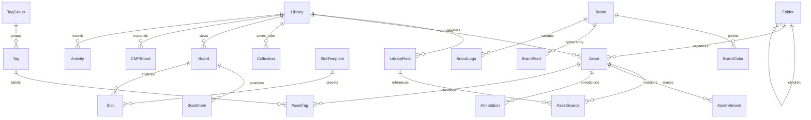

# Architecture

Cura is a local-first asset catalog, served by Node 22 on `127.0.0.1` to a browser. HTTP and WebSocket are the only web/server boundary. The desktop browser never uses proprietary filesystem APIs. AGENTS.md is the feature specification; this document fixes implementation interfaces.

## Packages and boundaries

- `packages/shared/src/catalog.ts`: Zod request/response/event contracts, inferred public types. JSON uses camelCase, IDs are UUID strings, timestamps are ISO strings, colors are HEX strings.
- `packages/server/src/catalog-store.ts`: SQLite transactions, domain integrity, FTS5, filtering and version lineage; consumes the existing migrated database.
- `packages/server/src/media/metadata.ts`: pure PNG metadata parser and generation-field normalization.
- `packages/server/src/media/worker.ts`: filesystem enumeration, streaming SHA-256, immutable snapshots, Sharp thumbnails, EXIF, palette and perceptual hashing, away from the request thread.
- `packages/server/src/media/service.ts`: bounded worker queue, root registration, chokidar events, rescan and recovery.
- `packages/server/src/catalog-routes.ts`: validated local HTTP and WebSocket endpoints; file access through catalog IDs, never arbitrary file download paths.
- `packages/web/src/catalog/`: library shell, virtualized asset view, inspector, preview and organization controls. Zustand stores view state; i18next owns UI strings. Only local static assets/fonts.
- P1 `boards`, `brands`, `exports`, and P2 `agents`, `sync`, `fcpxml` are independent modules using the same store and shared contracts.

## Storage and ownership

SQLite, logs, thumbnail cache, settings and immutable version snapshots live only in OS user-data/cache/log directories (or explicit CLI/environment overrides). A library is a logical catalog; it has zero or more referenced roots and one managed Inbox under the data directory. Registering a directory never writes to or renames originals. Upload copies bytes into Inbox. Removing an asset from the catalog is reversible soft deletion; permanent removal never deletes a referenced original.

Every ingested version has a content-addressed immutable snapshot before becoming visible. Replacing a referenced file can therefore preserve the previous bytes even after an external editor overwrites the source. Snapshots are deduplicated by SHA-256; displayed names remain human-readable. Database relative paths are normalized NFC with `/` as the stored separator; physical paths retain actual filesystem spelling in source aliases. Filesystem operations always use `path` helpers and realpath containment. Symlinks escaping registered roots are rejected. Upload names cannot contain separators or dot traversal.

Content duplicates merge within a library, keeping all source aliases. NFC/NFD variants of the same relative path identify one source; new differing bytes at that source append a version. Filename deduplication must not destroy distinct assets in different roots. If one of several source aliases changes bytes, fork that alias into a new asset with inherited history and metadata before appending its version. Unchanged aliases retain the original asset, preventing alternating rescans from changing its latest version. Versions and asset metadata survive restarts; deleting a missing source never deletes historical content.

## Data model

All persisted domain tables have `created_at` and `updated_at`. SQL migrations are versioned and run through Drizzle. SQL owns constraints and transactions; FTS5 and performance-sensitive searches use prepared SQLite statements.

`Asset`: id, libraryId, rootId, relativePath, name, hash, type, size, width, height, colors, phash, rating, note, source, model, prompt, negativePrompt, seed, params, exif, folderId, deletedAt, finalized, createdAt, updatedAt. `AssetVersion`: id, assetId, ordinal, hash, snapshotPath, thumbnailPath, file metadata and generation metadata. Source aliases map asset/root/normalized relative path to actual relative path. Annotation coordinates are normalized `[0,1]` and attach to a version. Folder parents cannot cycle or cross libraries. Smart collections persist validated query rules.

## HTTP contracts

All JSON request bodies and query strings are parsed with shared Zod schemas. Responses are validated with the corresponding schema. Failures return `{ error: string, code: string }`; invalid input is 400, unknown IDs 404, conflict 409, inaccessible paths 403. Permission errors carry actionable text including macOS Full Disk Access and Windows file-in-use guidance.

| Endpoint                                          | Purpose                                                                     |
| ------------------------------------------------- | --------------------------------------------------------------------------- |
| `GET /api/health`                                 | Existing startup health                                                     |
| `GET, POST /api/libraries`                        | List/create logical catalogs                                                |
| `GET /api/directories?path=`                      | Explicit local directory picker, directories only; no arbitrary file reads  |
| `GET, POST /api/libraries/:libraryId/roots`       | List/register referenced roots and start background scan                    |
| `POST /api/libraries/:libraryId/rescan`           | Reconcile interrupted scans and roots                                       |
| `POST /api/libraries/:libraryId/upload?name=`     | Raw-byte upload, bounded 100 MiB, copy to Inbox                             |
| `GET /api/libraries/:libraryId/assets`            | Paginated search and combined filters                                       |
| `GET, PATCH /api/assets/:assetId`                 | Full asset record and editable metadata                                     |
| `POST /api/libraries/:libraryId/assets/batch`     | Validated batch rating/folder/tags/trash/restore                            |
| `GET /api/assets/:assetId/versions`               | Immutable version history                                                   |
| `POST /api/assets/:assetId/replace?name=`         | Upload replacement, archive previous version                                |
| `GET /api/versions/:versionId/file`               | Safe file stream with content-type and nosniff                              |
| `GET /api/versions/:versionId/thumbnail`          | Safe cached preview; SVG originals never inline-executable                  |
| `GET, POST /api/assets/:assetId/annotations`      | Version-specific image notes                                                |
| `DELETE /api/annotations/:annotationId`           | Remove a note                                                               |
| `GET, POST /api/libraries/:libraryId/folders`     | Hierarchical catalog folders                                                |
| `GET, POST /api/libraries/:libraryId/tags`        | Colored/grouped tags                                                        |
| `GET, POST /api/libraries/:libraryId/collections` | Saved searches                                                              |
| `GET, PATCH /api/settings`                        | Persist language/theme/layout in user data; Zustand mirrors server settings |
| `GET, POST /api/libraries/:libraryId/tag-groups`  | Named tag groups                                                            |
| `PATCH, DELETE /api/folders/:id`                  | Rename/reparent/delete logical folders safely                               |
| `PATCH, DELETE /api/tags/:id`                     | Edit/remove tags                                                            |
| `PATCH, DELETE /api/tag-groups/:id`               | Edit/remove groups without deleting assets                                  |
| `PATCH, DELETE /api/collections/:id`              | Update/remove saved rules                                                   |
| `DELETE /api/roots/:id`                           | Unregister root and stop watcher; retained snapshots remain                 |
| `PATCH /api/libraries/:libraryId`                 | Rename catalog                                                              |
| `GET /api/diagnostics`                            | ZIP with version, platform, database stats and sanitized logs               |
| `POST /api/cache/rebuild`                         | Rebuild thumbnail cache without changing originals                          |
| `GET /api/events`                                 | WebSocket progress, asset changes and errors                                |

Asset queries: `q`, `folderId`, `tagId`, `rating`, `type`, `color`, `source`, `after`, `before`, `minWidth`, `minHeight`, `similarTo`, `trash`, `offset`, `limit`. Combining means AND. Text search covers filename, prompt, model, source, note and tag names; FTS syntax is quoted/escaped as user text. For Chinese and other unsegmented CJK input, combine FTS5 with indexed-library bounded substring matching (including one- and two-character terms) against the same normalized search text; benchmark this path at the release fixture scale. Color distance ranks palette matches; pHash Hamming distance ranks similar images. Responses include `{ items, total }` and pagination never exceeds 200 records.

WebSocket events: `{ type: 'scan' | 'asset' | 'error' | 'thumbnail', libraryId, rootId?, assetId?, completed?, total?, message? }`. UI refetches only active data; reconnect also refreshes. HTTP remains authoritative when sockets disconnect.

## Ingestion pipeline

1. Resolve and validate root registration, persist root, start watcher before initial enumeration.
2. Worker enumerates files without following escaping links. A bounded queue coalesces repeated events. Only completed/stable writes are ingested; transient errors are recorded and retried on next event/rescan.
3. Worker streams bytes into a temporary snapshot while computing SHA-256, checks source stat stability before/after and retries changed files. Metadata, palette, perceptual hash and thumbnail are derived from those same snapshot bytes. Atomically publish the snapshot and thumbnail only after processing succeeds. Sample 5–8 dominant colors.
4. Main thread commits source, asset, version, FTS and activity in one short transaction; same content is a no-op. Worker failures affect one file, not the scan.
5. Push progress and asset availability; live added files should appear within 5 seconds. Shutdown closes watchers and workers before SQLite.

Original file responses use Content-Disposition attachment and a restrictive sandbox CSP for potentially active content (SVG, HTML, XML, PDF and unknown formats); nosniff alone is insufficient. Rasterized SVG thumbnails are the only inline SVG preview. Unsupported formats retain original bytes and receive a generic preview. Malformed PNG metadata, corrupt images, huge chunks and decompression bombs have bounded parsers and safe fallback. P0 uses no external executable. P1 video uses browser decoding where supported because the prescribed ffmpeg-static package is GPL-3.0 and conflicts with the permissive runtime rule; any unmet format gate must remain explicit rather than silently claiming full support.

## Delivery and quality

A fresh `pnpm install && pnpm start` must build missing production artifacts and open the browser. Unit tests cover parsing, normalization, lineage, search, containment and persistence. E2E uses a real server and real Chromium, generated fixture files and offline requests. The milestone stress fixture creates 1000 unique images, checks all thumbnails, watcher latency, search latency and bounded rendered grid elements. UI screenshots go to `docs/screenshots/`. Only passing, reviewed commits are pushed to main; a tag requires the full milestone checklist plus actual green GitHub Actions.

P2 sync is an optional adapter configured through environment variables; local offline flows remain complete without credentials. No mock provider is represented as a real cloud connection. Portable exports carry original files, versions, annotations and human-readable metadata without proprietary lock-in.
