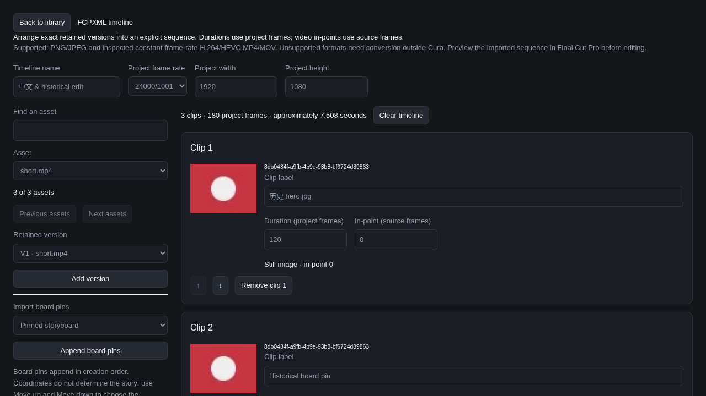

# FCPXML 1.7 export

Cura's timeline uses an explicit ordered list of exact asset-version pins. Durations use project frames; video in-points use source frames. Timing is reduced rational arithmetic, including the exact 24000/1001 timebase. Still images have editable durations; board coordinates do not define story order.

The supported interchange subset is one serial project spine, PNG/JPEG stills, and constant-frame-rate H.264/HEVC MP4/MOV with one video track and zero or one mono/stereo audio track. The bounded ISO-BMFF probe reads metadata, not movie payloads, and rejects variable frame rates, fragmented movies, unsupported codecs, complex edits, and missing timing. This is header validation, not a codec decoder. Convert unsupported source material outside Cura and import the result. No FFmpeg executable is required.

## Independent developer validation

Install `python3 -m pip install lxml==6.1.1`, then run:

```sh
python3 scripts/validate-fcpxml.py --prepare
python3 scripts/validate-fcpxml.py /path/to/timeline.fcpxml
python3 scripts/validate-fcpxml.py /path/to/extracted/timeline.fcpxml --package /path/to/extracted
```

The prepare step downloads the [official Apple FCPXML 1.7 DTD](https://developer.apple.com/library/archive/documentation/Miscellaneous/Conceptual/LegacyDTDsFinalCutPro/FCPXMLDTDv1.7/FCPXMLDTDv1.7.html) into ignored `.tmp/fcpxml/FCPXMLv1_7.dtd`. Its extracted SHA-256 is `d5d1db87d715cd99eddc407e61bb04e898b02aa8262d31ba2f8e5b038f702579`. Validation fails if it differs. Apple retains copyright in the DTD; it is neither vendored nor redistributed in Cura runtime/media packages. lxml is BSD-3-Clause and is used only for development verification, independently of the TypeScript generator.

The validator uses the DTD to check grammar and ID references, and Python `Fraction` to check timeline totals, offsets, frame alignment, and source boundaries. With `--package`, it also verifies exact-version order, SHA-256, sizes, and relocated file URLs. Automated tests exercise 24, 25, 30, and 24000/1001 frame rates and intentionally broken references.

Actual import into Final Cut Pro requires a macOS smoke test. Linux DTD validation does not establish behavior in Final Cut Pro or on physical Windows/macOS machines.

## Using the editor and package

Open **FCPXML timeline** from the library. Choose the project rate and dimensions, select an asset and an exact retained version, and add it to the sequence. Stills start with an editable five-second nominal duration: 120/125/150 frames at 24/25/30 fps, or 120 frames (5.005 seconds) at 24000/1001. Changing the project rate preserves the entered frame counts and changes their displayed duration. Use **Move up/down** for story order. A board import appends its current exact item/slot pins in creation order, irrespective of coordinates; reorder them explicitly.

For each video, select **Inspect video source**. The retained header supplies the exact source rate, sample count, dimensions and audio layout. Enter the source in-point in source frames and the clip duration in project frames. An in-point plus clip duration beyond the source is rejected. Packaging inspects the copied header again and rejects mismatches, missing bytes or failed SHA-256/size checks. No partially verified download is offered.

**Download local XML** uses proper file URLs pointing at the stable managed export directory on this computer. **Download media ZIP** includes `timeline.fcpxml`, the exact retained media, `manifest.json`, `README.txt` and an original standalone `relink.mjs` script. Extract the ZIP on the editing machine, run `node relink.mjs` inside the folder (or pass that folder as the first argument), and import `timeline.fcpxml`. The script uses Node built-ins, verifies each file's SHA-256 and size, rejects escaping paths, and atomically rewrites local URLs. Run it again after moving the folder. Relinking needs no Cura server, account, Python, Apple DTD or network.

Exports support up to 1,000 ordered clips and 3.4 GB of distinct retained media, using streamed ZIP STORE packaging. Repeated references to the same version share one media resource. Readable display names preserve each historical version's original extension; original names and exact IDs remain in the manifest. Completed requests remain in export history and can be loaded for further editing after a reload. Failed requests show per-clip guidance and can also be corrected and retried.

## Acceptance evidence

`e2e/fcpxml.spec.ts` runs against the actual HTTP server and Chromium with all non-loopback HTTP/WebSocket attempts blocked and recorded. It uploads JPEG/video/unsupported sources, replaces JPEG with PNG, selects the historical JPEG in the editor, imports a historical board pin, changes explicit order and frame counts, inspects a video's real timing, downloads XML and media ZIP, moves/relinks the extracted package and validates it independently against Apple's DTD with hashes and exact version order. It then reloads the persisted request and verifies an unsupported-file failure provides no package link. Evidence and a screenshot are Playwright attachments. The final focused Linux run took 5.3 seconds for the browser test (7.8 seconds with server startup), checked both English and Chinese controls, and recorded zero external attempts.

Server tests additionally validate four project timebases, deliberate dangling resource IDs, malformed movie headers, retained-source loss, cross-library pins, source overruns, forged timing, long readable filenames, destination folders containing `$&`, and relinking with the original managed export directory unavailable. These tests establish the generated grammar, rational timing, and retained-byte behavior; physical macOS/Windows and Final Cut Pro application import are not claimed.


